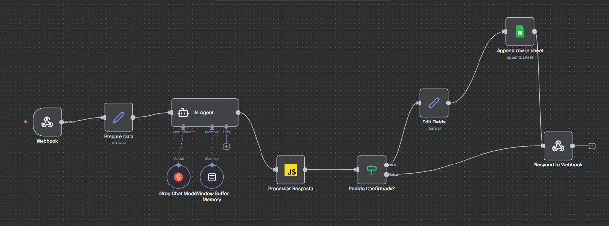

# 🍱 Takeaway - Sistema de Pedidos de Marmitas com IA

Sistema automatizado de atendimento e pedidos de marmitas utilizando **n8n**, **Groq AI** e interface web moderna.



---

## 📋 Sobre o Projeto

**Takeaway** é um sistema completo de atendimento automatizado para pedidos de marmitas que integra:
- 🤖 Agente de IA conversacional (Groq - LLaMA 3.3 70B)
- 🔄 Automação de workflows com n8n
- 💬 Interface de chat web moderna
- 📊 Registro automático de pedidos no Google Sheets
- 🧠 Memória de conversação para contexto contínuo

---

## ✨ Funcionalidades

### Chat com IA
- ✅ Apresentação automática do cardápio
- ✅ Conversa natural e contextualizada
- ✅ Aceita personalizações (ex: "sem salada", "extra arroz")
- ✅ Confirmação de pedido antes de finalizar
- ✅ Cálculo automático do valor total

### Backend (n8n)
- ✅ Webhook para receber pedidos via HTTP POST
- ✅ Processamento inteligente com IA
- ✅ Detecção automática de confirmação de pedido
- ✅ Extração de itens e personalizações
- ✅ Salvamento automático no Google Sheets
- ✅ Retorno estruturado em JSON

### Frontend
- ✅ Interface web responsiva
- ✅ Design moderno com gradientes
- ✅ Animações suaves
- ✅ Indicador de digitação
- ✅ Destaque visual para pedidos confirmados
- ✅ Sessão persistente por usuário

---

## 🍽️ Cardápio

| Item | Preço |
|------|-------|
| Marmita Frango | R$ 15,00 |
| Marmita Carne | R$ 18,00 |
| Marmita Vegetariana | R$ 12,00 |
| Marmita Peixe | R$ 20,00 |
| Marmita Kids | R$ 10,00 |

**Personalizações disponíveis:**
- Sem salada, sem feijão, sem arroz (sem custo adicional)
- Extra arroz, extra feijão, adicionar ovo (+R$ 2,00 cada)

---

## 🏗️ Arquitetura do Sistema

### Fluxo do Workflow (n8n)

```
┌─────────────────┐
│   Webhook       │ Recebe requisição POST
└────────┬────────┘
         ↓
┌─────────────────┐
│  Prepare Data   │ Formata chatInput e sessionId
└────────┬────────┘
         ↓
┌─────────────────┐
│   AI Agent      │ Processa com Groq + Memória
└────────┬────────┘
         ↓
┌─────────────────┐
│ Processar       │ Detecta confirmação e extrai dados
│ Resposta        │ Calcula valor total
└────────┬────────┘
         ↓
┌─────────────────┐
│ Pedido          │ Verifica se foi confirmado
│ Confirmado? (IF)│
└────┬───────┬────┘
     │       │
   TRUE    FALSE
     │       │
     ↓       └──────────────┐
┌─────────────────┐         │
│ Code (Formatar) │         │
└────────┬────────┘         │
         ↓                  │
┌─────────────────┐         │
│ Google Sheets   │         │
└────────┬────────┘         │
         │                  │
         ↓                  ↓
┌──────────────────────────┐
│  Respond to Webhook      │ Retorna JSON
└──────────────────────────┘
```

---

## 📦 Tecnologias Utilizadas

### Backend
- **n8n** - Automação de workflows
- **Groq** - Modelo de IA (LLaMA 3.3 70B Versatile)
- **Google Sheets API** - Armazenamento de pedidos
- **Window Buffer Memory** - Contexto de conversação

### Frontend
- **HTML5** - Estrutura
- **CSS3** - Estilização moderna com gradientes
- **JavaScript (Vanilla)** - Lógica e integração
- **Fetch API** - Comunicação com backend

---

## 🚀 Como Usar

### Pré-requisitos
- Conta no [n8n.cloud](https://n8n.io) ou instância n8n local
- Conta no [Groq](https://groq.com) (API key)
- Conta Google (para Google Sheets)
- Navegador web moderno

### 1. Configurar o Backend (n8n)

1. **Importe o workflow** no n8n (arquivo disponível na pasta `/workflow`)
2. **Configure as credenciais:**
   - Groq API
   - Google Sheets OAuth2
3. **Ajuste o webhook path** se necessário
4. **Ative o workflow**

### 2. Criar a Planilha Google Sheets

Crie uma planilha com os seguintes cabeçalhos:

| ID | Itens | Personalizações | Valor Total | Status | Timestamp | Mensagem |
|----|-------|-----------------|-------------|--------|-----------|----------|

**Link da planilha exemplo:** [Acessar Planilha](https://docs.google.com/spreadsheets/d/1w-GYsiWRkUhuaNMQtOps3wd_HfhVL3YpzX592anQv8w/edit?gid=0#gid=0)

### 3. Configurar o Frontend

1. **Abra o arquivo `index.html`**
2. **Verifique a URL do webhook** na linha:
   ```javascript
   const WEBHOOK_URL = 'https://nelljunior.app.n8n.cloud/webhook/order';
   ```
3. **Ajuste se necessário** para seu webhook

### 4. Rodar o Frontend

**Opção 1 - HTTP Server (Node.js):**
```bash
npx http-server -p 3000
```

**Opção 2 - Python:**
```bash
python -m http.server 3000
```

**Opção 3 - Live Server (VS Code):**
```bash
# Instale a extensão Live Server e clique em "Go Live"
```

Depois acesse: `http://localhost:3000`

---

## 🔌 API do Webhook

### Endpoint
```
POST https://nelljunior.app.n8n.cloud/webhook/order
```

### Request Body
```json
{
  "mensagem": "Olá, quero uma Marmita Frango sem salada",
  "sessionId": "sess_1731943200_abc123"
}
```

### Response (durante conversa)
```json
{
  "id": 1763491294968,
  "itens": [],
  "personalizacoes": [],
  "valor_total": 0,
  "status": "",
  "timestamp": "2025-11-18T18:41:34.968Z",
  "mensagem": "A Marmita Frango é uma ótima escolha! Alguma personalização?",
  "pedidoConfirmado": false
}
```

### Response (pedido confirmado)
```json
{
  "id": 1763491294968,
  "itens": ["Marmita Frango"],
  "personalizacoes": ["sem salada"],
  "valor_total": 15,
  "status": "confirmado",
  "timestamp": "2025-11-18T18:42:10.123Z",
  "mensagem": "Perfeito! Seu pedido foi confirmado. Obrigado!",
  "pedidoConfirmado": true
}
```

---

## 🧪 Testando com cURL

### Fazer um pedido:
```bash
curl -X POST "https://nelljunior.app.n8n.cloud/webhook/order" \
  -H "Content-Type: application/json" \
  -d '{
    "mensagem": "Quero uma Marmita Carne sem salada e extra arroz",
    "sessionId": "teste-001"
  }'
```

### Confirmar o pedido:
```bash
curl -X POST "https://nelljunior.app.n8n.cloud/webhook/order" \
  -H "Content-Type: application/json" \
  -d '{
    "mensagem": "Sim, confirmo o pedido",
    "sessionId": "teste-001"
  }'
```

---

## 📊 Estrutura de Pastas

```
takeaway/
│
├── index.html              # Frontend do chat
├── takeaway.png            # Screenshot do workflow n8n
├── README.md               # Este arquivo
│
└── workflow/
    └── Quentinha-Takeaway.json  # Workflow exportado do n8n
```

---

## 🐛 Troubleshooting

### Erro 404 no webhook
- ✅ Verifique se o workflow está **ATIVO** no n8n
- ✅ Confirme a URL do webhook (pode mudar entre test/production)

### CSP (Content Security Policy) bloqueando
- ✅ Use um servidor HTTP (não abra `file://` direto)
- ✅ Verifique a meta tag CSP no HTML

### Pedidos não salvam no Google Sheets
- ✅ Verifique as credenciais do Google
- ✅ Confirme que os cabeçalhos da planilha estão corretos
- ✅ Veja os logs de execução no n8n

### IA não responde corretamente
- ✅ Verifique a API key do Groq
- ✅ Revise o System Prompt no AI Agent
- ✅ Certifique-se que a memória está ativa

---

## 🎯 Melhorias Futuras

- [ ] Adicionar autenticação de usuário
- [ ] Implementar cancelamento de pedidos
- [ ] Suporte a múltiplos idiomas
- [ ] Notificações via WhatsApp/Telegram
- [ ] Dashboard administrativo
- [ ] Sistema de pagamento integrado
- [ ] Histórico de pedidos do cliente
- [ ] Avaliação/feedback pós-pedido

---

## 📄 Licença

Este projeto é open source e está disponível sob a [MIT License](LICENSE).

---

## 👥 Autor

**Nell Junior**
- GitHub: [@nelljunior](https://github.com/nelljunior)
- Projeto: [Takeaway](https://github.com/nelljunior/takeaway)

---

## 🙏 Agradecimentos

- [n8n](https://n8n.io) - Plataforma de automação
- [Groq](https://groq.com) - Inferência de IA ultrarrápida
- [Google Sheets](https://sheets.google.com) - Armazenamento de dados
- Comunidade open source

---

## 📞 Suporte

Para dúvidas ou problemas:
1. Abra uma [Issue](https://github.com/nelljunior/takeaway/issues)
2. Consulte a [Documentação do n8n](https://docs.n8n.io)
3. Veja os logs de execução no n8n

---

**⭐ Se este projeto foi útil, considere dar uma estrela no GitHub!**